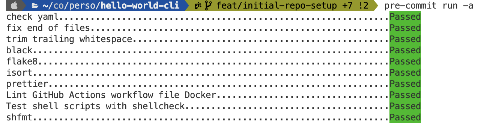
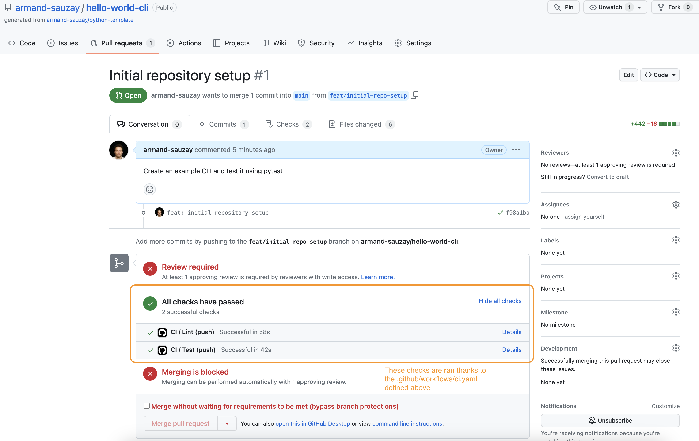
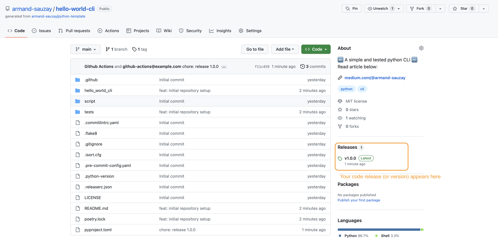

# How to properly setup your Python project

Industry best practices to kickstart your python project.

<p align="center">Photo by David Clode on Unsplash</p>

As you start working on your python project, you will likely need to set it up
in a consistent and collaboration-friendly way. In this article, I'll describe a
setup that works great for my projects. It includes many industry best practices
and aims at explaining how to install python, run automated checks in a GitOps
fashion and structure your project.

This article covers quite a few topics. To ease the reading, I've split each topic into two parts:
- 📚 indicates the __theory__ part 
- 🛠️ indicates the __practical__ part (i.e. the commands you need to run).

Sometimes you will also see a 💡 section, indicating a tip or a trick.

## Table of Contents

1. [Install a Python version manager](#1-install-a-python-version-manager)
2. [Choose an environment manager (poetry)](#2-choose-an-environment-manager-poetry)
3. [Alternatively, use Docker as a Dev Environment instead](#3-alternatively-use-docker-as-a-dev-environment-instead)
4. [Add Some Code](#4-add-some-code)
5. [Write Some Tests](#5-write-some-tests)
6. [Lint your code](#6-lint-your-code)
7. [Automate checks on local with pre-commit](#7-automate-checks-on-local-with-pre-commit)
8. [Automate checks on remote with GitHub Actions](#8-automate-checks-on-remote-with-github-actions)
9. [Automate your release with GitHub Actions](#9-automate-your-release-with-github-actions)
10. [Enjoy the benefits of your new code practices](#10-enjoy-the-benefits-of-your-new-code-practices)


## 1. Install a Python version manager

📚 The first thing you will need to do is to install a python version manager. A
python version manager will allow you to install multiple versions of python on
your machine and switch between them easily.

To illustrate this, let's say you have a project that requires python 3.6 and
another project that requires python 3.7. If you only have python 3.7 installed
on your machine, you will have to uninstall it and install python 3.6 every time
you want to work on the first project... This is where a python version manager
comes in handy.

You can use [pyenv](https://github.com/pyenv/pyenv) for this and follow the 
[installation instructions](https://github.com/pyenv/pyenv#installation). 

🛠️ At the time of writing this document, you can install pyenv by running the
following:

```bash
curl https://pyenv.run | bash
```

If you want more control over the installation, on mac for instance you can run:

1. Use brew to install pyenv
    ```bash
    brew install pyenv
    ```

2. Depending on the shell you use, add pyenv to your PATH.

    💡 If you're not sure which shell you're using, you can run the following command:
    ```bash
    echo $SHELL
    ```
    For bash:
    ```bash
    echo 'export PYENV_ROOT="$HOME/.pyenv"' >> ~/.bashrc
    echo 'command -v pyenv >/dev/null || export PATH="$PYENV_ROOT/bin:$PATH"' >> ~/.bashrc
    echo 'eval "$(pyenv init -)"' >> ~/.bashrc
    ```
    For zsh:
    ```bash
    echo 'export PYENV_ROOT="$HOME/.pyenv"' >> ~/.zshrc
    echo 'command -v pyenv >/dev/null || export PATH="$PYENV_ROOT/bin:$PATH"' >> ~/.zshrc
    echo 'eval "$(pyenv init -)"' >> ~/.zshrc
    ```

## 2. Choose an environment manager (poetry)

📚 Now that you have a python version manager, you will need to install an
environment manager. An environment manager will allow you to create isolated
environments for your projects. This is useful when you work on multiple
projects that require different versions of the same package. And it is a great
practice overall to make sure anyone can run your project. 

To illustrate this, let's say you have a project that requires `pandas` and
`matplotlib` to do some data analysis and another project that requires
`tensorflow` to do some machine learning. It is considered a good practice to
create a separate environment for each project. This way, you can install
only the packages you need for each project and avoid any conflicts between
packages.

There are many environment managers (pipenv, conda, virtualenv, python
built-in venv, etc...). I personally use [poetry](https://python-poetry.org/).

In general, your environment manager will be installed with your python version. 
For instance, if you use pyenv, you can install poetry by running the following command:
```bash
pyenv install 3.10.6
pyenv global 3.10.6
pip install poetry
```

In this case, poetry will live in your python environment. This means that
you can have a different version of poetry for each python version you have
installed on your machine.


🛠️ Pip installing poetry in your python environment with pip is one way to do it but you can also follow the steps below:

1. Use the curl command to install poetry
    ```bash
    curl -sSL https://install.python-poetry.org | python3 -
    ```

2. Add poetry to your PATH. On MacOS, poetry is added at `~/Library/Application
Support/pypoetry/venv/bin/poetry`. So you can add it to your PATH by adding the
following line to your ~/.bashrc or ~/.zshrc file:
    ```bash
    export PATH="$HOME/Library/Application Support/pypoetry/venv/bin:$PATH"
    ```
    If you are using a different shell, you can find the path to poetry by running the following command:
    ```bash
    poetry config --list --local | grep virtualenvs.path
    ```
    And then add it to your PATH.

## 3. Alternatively, use Docker as a Dev Environment instead

If you don't want to install a python version manager and an environment
manager, or want to abstract this for your team, you can use Docker instead. I
won't go into too many details here but if you're interested, VSCode has a great
[integration with
Docker](https://code.visualstudio.com/docs/devcontainers/containers)

## 4. Add Some Code

📚 Now that you have a python version manager and an environment manager, you
can start working on your project. Let's write some simple functions to get
started. For illustration purposes we'll create a simple CLI that prints "Hello
`<name>`" when you run it and give how many repositories `<name>` has on GitHub.

💡 By default, poetry wants you to create a package with a folder named as your
git repository (with the only difference that it wants underscores instead of dashes). So if your git
repository is called `python-project-template`, poetry will create a folder
called `python_project_template`.

💡 You can find the code for this section at [armand-sauzay/hello-world-cli](https://github.com/armand-sauzay/hello-world-cli)

In this case let's call our project `hello-world`. So we'll create a folder
called `hello_world` and add a file called `__init__.py` to it. 


🛠️ Use gh to create a new repository called `hello-world` and clone it to your
machine:
```bash
gh repo create <your-github-username>/hello-world-cli --template armand-sauzay/python-template --public
```

To initialize your project, run the following command (it comes from the template above):
```bash
./script/bootstrap
```

Add the requests package to your project:
```bash
poetry add requests
```

So far, we ran the following commands:
```bash
pyenv install 3.10.6 # install python 3.10.6
pyenv global 3.10.6 # (optional) set python 3.10.6 as the default python version
pip install poetry # install poetry as a python package in your python 3.10.6 environment
poetry add requests # add the requests package to your project
```

In `hello_world_cli` folder a file called `main.py` and add the following code to it:
```python
import argparse
import requests


def main(argv=None) -> int:
    parser = argparse.ArgumentParser()
    parser.add_argument(
        "--name", help="The name to greet and count repos for", default="world"
    )
    args = parser.parse_args(argv)
    if args.name == "":
        print("Username cannot be empty")
        return 1

    print(f"Hello {args.name}!")

    repos = requests.get(f"https://api.github.com/users/{args.name}/repos")
    if repos.status_code != 200:
        print(f"Failed to fetch repos for {args.name}")
        return 1
    repos = repos.json()
    print(f"You have {len(repos)} repos.")  # type: ignore
    return 0


if __name__ == "__main__":
    raise SystemExit(main())

```

There are a few tricks here that are worth mentioning:
- We use `argparse` to parse the arguments passed to our CLI. This is a built-in
  python package that allows you to parse arguments passed to your CLI. 
- We use `argv` to pass the arguments to our main function. This is useful for
  testing purposes. We can pass a list of arguments to our main function and
  test it without having to run the CLI.
- We use `SystemExit` to exit our program. This is a built-in python exception
  that allows you to exit your program with a specific exit code (0 for success, 1 for failure).

## 5. Write Some Tests

📚 Now that you have a few basic methods, you can start writing some tests. Tests make sure your code behaves as expected. There
are many types of tests (unit tests, integration tests, end-to-end tests, etc...)
but in this article, we will focus on unit tests. Unit tests are tests that
check the smallest unit of your code (i.e. a function or a method).

🛠️ Create a file called `test_main.py` and add the following code to it:
```python
from hello_world_cli.cli import main

def test_main(capsys):
    assert main(['--name', 'test']) == 0
    out, err = capsys.readouterr()
    # test is a user which does not have any contributions since 2010. 
    # Hopefully this will not change in the future and the test will not break.
    assert out == 'Hello test!\nYou have 5 repos.\n'
    assert err == ''

def test_main_empty_name(capsys):
    assert main(['--name', '']) == 1
    out, err = capsys.readouterr()
    assert out == 'Username cannot be empty\n'
    assert err == ''
```

- We use `capsys` to capture the output of our CLI. This is a pytest built-in that allows you to capture the output of your CLI.

## 6. Lint your code

📚 Now that you have some tests, you can start linting your code. Linting is the
process of checking your code for potential errors. There are many linters out
there (pylint, flake8, black, etc...). I personally use flake8, black, isort and
mypy. Ruff is also becoming quite popular and replaces flake8 and isort.

🛠️ To install flake8, black, isort and mypy, you can run the following command:
```bash
poetry add --dev flake8 black isort mypy
```

Then you can use mypy to check your code:
```bash
poetry run mypy hello_world_cli/cli.py
```

You can use flake8 to check your code:
```bash
poetry run flake8 hello_world_cli/cli.py
```

You can use black to format your code:
```bash
poetry run black hello_world_cli/cli.py
```

But you would not really want to run these commands manually every time you
change your code. This is where pre-commit comes in handy, to both make sure you
don't commit wrongly formatted code and to not have to run these commands
manually.

Also, do note that some of these linters have small incompatible differences.
For example, black will complain if you have a line longer than 88 characters,
but flake8 will complain if you have a line longer than 79 characters. You need
to configure them to work correctly together: 
- you should create a .flake8 file with the following content:
```bash
[flake8]
max-line-length = 88
extend-ignore = E203
```
- you should create a .isort.cfg file with the following content:
```bash
[settings]
profile = black
```
- you can read more on the [black documentation](https://black.readthedocs.io/en/stable/guides/using_black_with_other_tools.html)


## 7. Automate checks on local with pre-commit

📚 Now that you have some tests and some linters, you can start automating your
checks. The goal of automating your checks is to make sure your code is always
in a good state. There are many tools out there that can help you automate your
checks (pre-commit, tox, etc...). I personally use pre-commit.

🛠️ To install pre-commit, you can run the following command:
```bash
brew install pre-commit
```

Then you can run pre-commit
```bash
pre-commit run --all-files
```

[](images/pre-commit.png)
- You can see on the image above that pre-commit is running the checks that we
  defined in the `.pre-commit-config.yaml` file.
- Note that this file is coming from the template above in 
[step 4](#4-add-some-code).

## 8. Automate checks on remote with GitHub Actions

📚 Now that you have some tests and some linters, you can start automating your
checks on the server side. The goal of automating your checks on the server side
is to make sure your code is always in a good state. There are many tools out
there that can help you automate your checks (GitHub Actions, Travis CI, Circle
CI, etc...). I personally use GitHub Actions.

🛠️ To set up GitHub Actions, you can create a file called `.github/workflows/ci.yaml` and add the following code to it:
```yaml
name: CI

on:
  workflow_dispatch:
  push:
jobs:
  lint:
    name: Lint
    runs-on: ubuntu-latest
    steps:
      - uses: armand-sauzay/actions-python/lint@v1
        with:
          github-token: ${{ secrets.GITHUB_TOKEN }}

  test:
    name: Test
    runs-on: ubuntu-latest
    steps:
      - uses: armand-sauzay/actions-python/test@v1
        with:
          github-token: ${{ secrets.GITHUB_TOKEN }}
          test-flags: --version
```

Note that this file should already be created if you used the template mentionned above (see gh command in [step 4](#4-add-some-code). 

Explanation: 
- If you're not familiar with the syntax of GitHub Actions, you can read the [documentation](https://docs.github.com/en/actions/reference/workflow-syntax-for-github-actions).
- Here we call two jobs: lint and test. Each job runs on ubuntu-latest (a Linux machine).
- The lint job uses the [armand-sauzay/actions-python/lint](https://github.com/armand-sauzay/actions-python/tree/main/lint) action to run pre-commit.
- The test job uses the [armand-sauzay/actions-python/test](https://github.com/armand-sauzay/actions-python/tree/main/test) action to run pytest. Here we pass a flag to pytest to just have a dummy test. You can remove this flag to run your actual tests.

[](images/remote-checks.png)

## 9. Automate your release with GitHub Actions

📚 We have briefly talked about linting - using black, flake8, isort and mypy - and testing - using pytest. Release is an equally important concept that allows you to give versions to 

🛠️ To set up GitHub Actions, you can create a file called `.github/workflows/release.yaml` and add the following code to it:
```yaml
name: Release

on:
  push:
    branches:
      - main
  workflow_dispatch: # enable manual release

jobs:
  lint:
    name: Lint
    runs-on: ubuntu-latest
    steps:
      - uses: armand-sauzay/actions-python/lint@v1
        with:
          github-token: ${{ secrets.GITHUB_TOKEN }}

  test:
    name: Test
    runs-on: ubuntu-latest
    steps:
      - uses: armand-sauzay/actions-python/test@v1
        with:
          github-token: ${{ secrets.GITHUB_TOKEN }}
          test-flags: --version

  release:
    name: Release
    needs: [lint, test]
    runs-on: ubuntu-latest
    outputs:
      new-release-published: ${{ steps.release.outputs.new-release-published }}
      new-release-version: ${{ steps.release.outputs.new-release-version }}
    steps:
      - uses: armand-sauzay/actions-python/release@v1
        id: release
        with:
          github-token: ${{ secrets.ADMIN_TOKEN || secrets.GITHUB_TOKEN }}
```

[](images/release.png)

A few things worth noting:
- this workflow will trigger on push on the main branch and on manual trigger (workflow_dispatch)
- it will run the lint and test jobs
- it will then run the release job which is semantically versioning your code and creating a release on GitHub. In case you don't know what semantic versioning is, you can read the [documentation](https://semver.org/).
- In order to follow semantic versioning, you can follow conventional commits (this is why the commits show up as `fix: ...` or `feat: ...` in the release notes). You can read more on [conventional commits](https://www.conventionalcommits.org/en/v1.0.0/).
- Sometimes you might have a protected branch, for which the default GITHUB_TOKEN wouldn't have enough permissions to create a release. In that case, you can create a personal access token called `ADMIN_TOKEN` and give it the right permissions. You can then use this token in the workflow.


## 10. Enjoy the benefits of your new code practices

Now you know how to: 
- use pyenv to install different python versions 
- use poetry to manage your dependencies (poetry add/remove)
- use pytest to test your python code 
- what linting is and how to use flake8, black, isort and mypy
- use pre-commit to automate your checks on your local machine
- use GitHub Actions to automate your checks on the server side

Enjoy the benefits of your new code practices! 🎉

As always, if you have any questions, feel free to leave a comment below or reach out to me on the different platforms:

<p align="center">
<a href="https://github.com/armand-sauzay">
    
</a>
<a href="https://twitter.com/armandsauzay">
    
</a>
<a href="https://www.linkedin.com/in/armand-sauzay-80a70b160/">
    
</a>
<a href="https://armand-sauzay.github.io/#/about">
    
</a>
<a href="https://medium.com/@armand-sauzay">
    
</a>
<a href="https://dev.to/armandsauzay">
    
</a>


